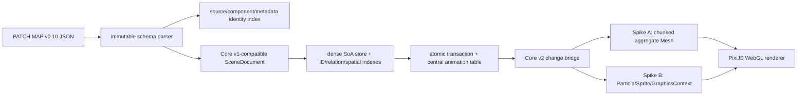

# Performance Core v2: PixiJS architecture and experiment plan

## Decision status

Core v2 keeps the Core v1 dense store, transaction planner, animation table, spatial index, and stable ID semantics as the common control. It replaces only normalization at the input edge and rendering/resource orchestration at the output edge. The production baseline is PixiJS v8 WebGL. WebGPU is an explicitly experimental result and cannot select the production renderer.

The final aggregate renderer is not selected by design preference. Two implementations must pass the same correctness gates and then run against the same normalized store:

- **Spike A — aggregate Mesh:** fixed-capacity geometry chunks for rectangles, bars, and relations. Store changes mark chunks dirty; only dirty chunk buffers are uploaded. Icons use atlas-backed sprites or particles, while text uses the policy below.
- **Spike B — Particle/Sprite/GraphicsContext:** white-texture particles for rectangles and bars, atlas particles/sprites for icons, and retained `GraphicsContext` geometry for static shapes and relations. Particle dynamic properties deliberately expose the cost of whole-container dynamic uploads.

Custom render pipes or batchers are not the first implementation. They are backend-specific extension points with a larger lifecycle and shader compatibility surface. A custom pipe is justified only if the public Mesh implementation misses the animation target after profiling and a measured spike improves the failing phase.

## Official PixiJS v8 findings

| Area | Public API finding | Core v2 consequence |
| --- | --- | --- |
| Application and render loop | `new Application()` is followed by async `init()`. `autoStart: false` permits explicit `app.render()` and avoids an always-running ticker. [Application](https://pixijs.com/8.x/guides/components/application), [render loop](https://pixijs.com/8.x/guides/concepts/render-loop) | Initialization is async; the data model remains synchronous after creation. Rendering is invalidation-driven and runs continuously only during gestures or animation. |
| Backend | WebGL is the recommended stable backend. WebGPU is feature-complete but still experimental and affected by browser implementation differences. [Renderers](https://pixijs.com/8.x/guides/components/renderers) | Force `preference: 'webgl'` for production evidence. Record WebGPU separately when available. |
| Scene graph | The root is already a render group; additional render groups can move group transforms to the GPU, but too many add overhead. [Render groups](https://pixijs.com/8.x/guides/concepts/render-groups) | Use a small labeled hierarchy: world, static, dynamic, relation, text/assets, and interaction overlay. Never create one container per entity. |
| Mesh and buffers | Mesh accepts reusable geometry and shaders. Public buffers expose `update(sizeInBytes)` but no portable arbitrary byte-offset upload. [Mesh](https://pixijs.com/8.x/guides/components/scene-objects/mesh), [Buffer API](https://pixijs.download/release/docs/rendering.Buffer.html) | Use fixed-capacity chunks and upload only dirty chunks. Do not claim arbitrary sub-buffer ranges that the public API cannot prove. |
| Custom renderer extensions | Renderer work is split into systems and pipes; a custom `RenderPipe` owns add/update/validate/destroy lifecycle. Custom batchers are advanced extension points. [Architecture](https://pixijs.com/8.x/guides/concepts/architecture), [RenderPipe API](https://pixijs.download/v8.18.1/docs/rendering.RenderPipe.html) | Keep renderer-specific code behind one adapter. Escalate to a custom pipe only at a measured selection checkpoint. |
| Particles and sprites | `ParticleContainer` is optimized for many lightweight particles, has explicit static/dynamic property choices, and is marked stable-but-experimental. Dynamic properties are uploaded every frame; static changes need `update()`. [ParticleContainer](https://pixijs.com/8.x/guides/components/scene-objects/particle-container), [Sprite](https://pixijs.com/8.x/guides/components/scene-objects/sprite) | Spike B groups particles by texture source/atlas and sets an explicit bounds area. It is a comparison candidate, not an assumed winner. |
| Graphics | `GraphicsContext` is shareable retained geometry. Repeatedly clearing and rebuilding graphics is an avoidable dynamic cost. [Graphics](https://pixijs.com/8.x/guides/components/scene-objects/graphics) | Use retained contexts only for static/fallback geometry and rebuild aggregate relation contexts at transaction boundaries, not every frame. |
| Text | `Text` creates textures and is expensive to update. `BitmapText` uses an atlas and scales to frequently changing short text; very large CJK/emoji alphabets are poor bitmap-font candidates. [Text](https://pixijs.com/8.x/guides/components/scene-objects/text), [BitmapText](https://pixijs.com/8.x/guides/components/scene-objects/text/bitmap) | Dynamic ASCII numbers and short labels use BitmapText/MSDF where a font is registered. CJK, emoji, wrapping, and advanced styles use a guarded `Text` fallback with explicit counts and update metrics. |
| Assets and upload | `Assets.load()` caches resources; `Assets.unload()` releases the cache entry. The Prepare extension can explicitly upload resources before the visible frame. [Assets](https://pixijs.com/8.x/guides/components/assets), [textures](https://pixijs.com/8.x/guides/components/textures), [Prepare API](https://pixijs.download/dev/docs/rendering.PrepareSystem.html) | Asset aliases map to caller-provided URLs/atlas frames. Load/unload is explicit. GPU-preparation time is measured separately from normalization/store load. |
| Events and coordinates | Federated events support root hit areas and event modes; hit testing normally walks interactive descendants. [Events](https://pixijs.com/8.x/guides/components/events) | The stage alone is interactive, has a screen-sized hit area, and has `interactiveChildren = false`. Screen coordinates are inverse-transformed, then the dense-store spatial index decides the target. |
| Caching, culling, extraction, destruction | Culling can exchange CPU cost for GPU savings; `cacheAsTexture` allocates an extra texture and fits stable complex content. Extract can produce pixels/canvas/image/texture and is expensive. GPU resources need explicit destruction. [Performance tips](https://pixijs.com/8.x/guides/concepts/performance-tips), [garbage collection](https://pixijs.com/8.x/guides/concepts/garbage-collection), [Extract API](https://pixijs.download/release/docs/rendering.ExtractSystem.html) | Do not cache the large dynamic world. Do not enable culling without evidence. Capture is an explicit diagnostic operation. Destroy clears application, geometry, text, textures owned by Core v2, handlers, and scheduled frames. |

## Input inventory and compatibility boundary

The public input is the existing PATCH MAP v0.10 JSON value, not a preconverted scene document. The parser never mutates it. It emits a dense-scene document plus a source identity index and diagnostics.

| Input shape | Observed/declared fields | Core v2 support |
| --- | --- | --- |
| top-level/group | `id`, `label`, `show`, `locked`, `attrs`, nested elements | Recursive, deterministic path ID when an ID is absent, with a warning. Caller IDs are preserved. |
| grid | `cells`, `item`, `gap`, `inactiveCellStrategy`, item size/padding/orientation/components | Active cells expand to deterministic `${gridId}.${row}.${column}` entities. String cell identity is retained in the source index. Unsupported layout nuance is diagnosed. |
| item | `size`, `components`, `padding`, `contentOrientation` | Background/bar/icon/text components become deterministic compound entities without changing the source component ID. |
| relations | `links`, `style`, string or `{ id }` endpoints | Aggregate relation geometry; dangling endpoints are an error. Relation group/link identity is indexed. |
| rect/image/text | direct element attributes plus source/style/fill/stroke/radius | Direct input support. Rect radius and complex strokes may take a documented fallback path. |
| component | `background`, `bar`, `icon`, `text`; observed size/source/tint/margin/placement/animation fields | Supported. Component identity is `(owner entity ID, source component ID, occurrence)` and stays stable across reloads of identical JSON. |
| attrs/metadata | observed `x`, `y`, `angle`, `display`; relation metadata with light/dark color and parent; schema permits open attrs | Known transform/display fields affect rendering. Unknown attributes and metadata are retained in the source index and reported when they cannot affect rendering. |

No record is silently dropped. Invisible records remain indexed and are omitted from visible geometry. Missing IDs, unknown colors/assets, unsupported rich text, non-rectangular layout behavior, and style degradation are represented by deterministic diagnostics. Duplicate stable IDs, invalid relation endpoints, or non-finite geometry fail the load atomically.

## Data and rendering pipeline

Core v1 remains the common model control. Core v2 adds a thin bridge with a monotonically increasing store epoch, full-rebuild flag, view invalidation, and changed slot ranges. A reload changes the epoch even when IDs or slots repeat, preventing stale GPU cache reuse. Kind and generation are checked when a chunk is synchronized.

The stage and aggregate layers receive meaningful labels and debug counters so PixiJS DevTools exposes the application and architectural layers. `debugSnapshot()` reports entity counts, geometry chunks, draw submissions, uploaded bytes/chunks, text fallback counts, asset counts, and the last invalidation reason. A draw submission is defined as one aggregate renderable submitted by Core v2, not a Canvas command.

## Frame scheduling and interaction

The scheduler has one requestAnimationFrame callback and one monotonic local animation clock. Data commits, resize, asset completion, selection, and view changes set invalidation flags. An idle invalidation schedules exactly one frame. Animation or an active pan/zoom gesture schedules the next frame only while work remains.

Each animation frame advances the common dense animation table, records changed ranges, synchronizes the renderer, and renders once. Bar animation visibly interpolates geometry. Fixed chunks make an update upload proportional to touched chunks rather than total entity count. No entity owns a ticker, closure, listener, or Pixi event target.

The stage receives pointer and wheel events. Cursor-centered zoom preserves the world point under the cursor. Selection maps screen coordinates through the inverse viewport transform, then uses the common exact spatial hit test. Empty and non-target hits clear or preserve selection according to the explicit dispatch policy; the overlay is a single aggregate diagnostic object.

## Experiment matrix and selection rule

Every run uses seeded input and the same direct JSON parser, dense store, view, animation schedule, asset map, text mutations, and hit coordinates. Sizes are 100, 500, 1,000, 2,000, and 5,000 generated objects plus the production JSON. Chromium at 4× CPU slowdown is a development proxy; Windows native remains `pending` until executed on that host.

Warm up twice, measure seven times, and retain every raw sample. For every phase report min, median, p95, and max:

1. immutable normalization;
2. dense-store load;
3. GPU synchronization/upload;
4. first visible frame;
5. pan/zoom frame p95;
6. full and 10% bar animation frame p95 plus completion time;
7. first text render and seeded random text change;
8. transformed hit-test and selection;
9. resize;
10. destroy and re-initialize;
11. retained heap after lifecycle loops.

Correctness is a hard gate: direct legacy load, deterministic output, immutable input, visible bar interpolation, text mutation, transformed hit behavior, asset load/unload, resize, destroy/re-init, capture, package consumer, and headed-browser console/network error count zero.

Among passing spikes, choose Mesh when it improves either full or partial production bar-animation p95 by at least 15% without making first visible frame or retained heap more than 25% worse. Choose the simpler Particle/Graphics implementation when Mesh does not clear that threshold. Either candidate must keep production animation p95 below 33.3 ms in the Chromium 4× proxy. A miss is reported rather than hidden.

## Risks and proof obligations

- Public Pixi buffers do not promise arbitrary offset updates. The evidence must say “dirty chunk upload,” not “byte-range update,” unless a later official API proves otherwise.
- `ParticleContainer` has experimental status and dynamic properties can force full property-buffer uploads.
- CJK/rich-text fallback can reintroduce many scene objects and texture churn. Counts and random-change timings must be reported.
- Atlas grouping depends on shared texture sources. Unresolved aliases must render a deterministic placeholder and emit a diagnostic.
- WebGL and WebGPU shader languages/resources differ. Any custom shader must contain both supported programs or remain WebGL-only and be labeled accordingly.
- Rounded rectangles, advanced strokes, masks, blend modes, filters, rich text, and arbitrary open metadata may be only partially rendered; the final schema table must distinguish retained, rendered, degraded, and unsupported.
- Pixi global caches and browser GPU allocations make `destroy()` evidence sensitive. Heap proof must combine repeated application lifecycle, explicit resource unload/destruction, and post-GC retained-heap deltas where browser support permits.
- Core v1 slot generations can collide across a reload. Core v2 must key renderer caches by its own store epoch plus slot/generation rather than weakening the stable-ID contract.

