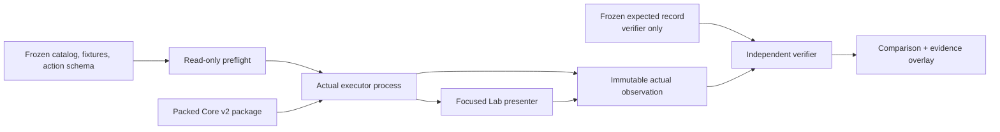

# Core v2 actual-observation automation and focused Lab design

Status: implementation design. This document does not revise the functional contract,
canonical fixtures, normalized expected observations, review registry, or catalog
manifest.

Implementation update (2026-07-20): catalog/action preflight, expected-blind execution,
semantic comparison, append-only evidence, and the 173-route shell are committed.
Exactly 14 P0 routes are executable and 159 remain explicit stubs. Thirteen produce
actual observations; `DAT-008` preserves the immutable missing binding operand as a
failed actual with completed cleanup. Independent Lab review and 40 tests cover case
selection, handler collision freedom, supplemental WebGL ownership, failure truth,
and action-row state. Packed-host, outer two-browser fresh sessions, and headed
promotion evidence have not run and remain non-passing.

## Decision summary

Build one shared case-execution library with two deliberately separate callers:

1. an actual-observation executor that can read approved fixtures, action definitions,
   the opaque approved-expected digest, and the packed Core v2 package, but cannot read
   expected assertion values; and
2. a verifier that starts only after execution, reads an immutable actual artifact and
   the canonical expected record, applies the closed observation operators, and emits
   a comparison/evidence overlay.

The light-theme Lab uses the same fixture materializer, action handlers, semantic
observer, and cleanup ledger. It is a single-page shell, but every approved catalog ID
is a distinct URL and owns an isolated case presenter. A related case can never satisfy
the selected route.

The frozen catalog currently binds:

| Inventory | Count |
| --- | ---: |
| Approved cases | 173 |
| Capability cases | 135 |
| Consumer journeys | 38 |
| P0 / P1 | 121 / 52 |
| Canonical action steps | 646 |
| Exact action handler IDs | 381 |
| Normalized assertions | 2,257 |
| Unique routes / root test IDs | 173 / 173 |

The current `lab/performance-v2` page remains useful as a light-theme visual and
PixiJS lifecycle reference, and the current browser proof remains useful diagnostic
coverage. Neither is contract execution evidence: the page is a broad performance
dashboard rather than a focused case route, and the browser proof performs one broad
workflow while reading and mutating the live runtime directly. The contract route must
not overwrite its existing results.

## Immutable inputs and output boundary

### Read-only contract inputs

The runner preflight reads and verifies these inputs without regenerating them:

- `catalog-evidence-manifest.v1.json`
- `catalog-review-registry.v1.json`
- `catalog-fixtures.v1.json`
- `catalog-fixture-profiles.v1.json`
- `catalog-typed-cases.v1.json`
- `catalog-action-schema.v1.json`
- `catalog-observation-schema.v1.json`
- `catalog-normalized-expected.v1.json` (verifier process only)

Preflight must reproduce the manifest/review digest checks and the existing static
catalog gates before launching a browser. It also checks exact case, route, test-ID,
fixture, expected-record, profile, opcode, operand-shape, binding, capture-checkpoint,
target-reference, and dataset-transition parity. Catalog generation is never part of
execution. There is intentionally no `--accept`, snapshot-update, or expected-rewrite
mode.

The executor receives the expected record SHA-256 as an opaque provenance binding
because the observation contract requires it. It does not receive the expected record,
assertion paths, operators, operands, or comparison library. A dependency-firewall test
must fail if the executor or Lab runtime imports the normalized-expected file or the
verifier module.

### New execution output only

Raw execution belongs in a new, append-only path such as:

```text
performance/core-v2/contract-results/<run-id>/
  execution-manifest.json
  cases/<lowercase-case-id>/
    fresh-a.actual.json
    fresh-b.actual.json
    comparison.json
    evidence.json
    evidence.json.sha256
    logs/
    screenshots/
```

`<run-id>` includes UTC start time, packed-package digest prefix, and runner revision.
Reruns create a new directory. They never replace existing results and never edit the
canonical catalog's `execution.status: not-run` fields. Promotion state is represented
by the new execution overlay, which binds the full canonical catalog-manifest digest.
Canonical logs remain owned by the primary agent.

## Runner architecture and trust boundaries



### Boundary responsibilities

| Boundary | May read | Produces | Must not do |
| --- | --- | --- | --- |
| Catalog preflight | canonical manifest, review registry, fixtures, profiles, action/observation schemas | selected immutable case plan and verified digests | generate or edit canonical evidence |
| Fixture materializer | verified fixture/profile, route size/seed, local deterministic fixture assets | caller-owned dataset clone, fixed action trace, bindings, dataset digest | read expected assertions or rewrite literal operands |
| Action executor | materialized fixture, exact `contract/<type>` handler, packed public package/host seam | ordered action deltas, captures, milestones, actual semantic facts | call a nearby handler, skip an unknown opcode, or fabricate a pass |
| Browser input driver | actual gesture plan, mounted Lab, Playwright/hardware input | native input trace and terminal actual outcome | call engine selection/transform methods in place of input |
| Semantic observer | public package observations plus browser/host facts | `core-v2-semantic-observation/1` document | consult expected values or private PixiJS/package internals |
| Verifier | immutable actual artifact, expected record, observation schema | assertion results, determinism result, comparison digest | execute engine code or normalize actual toward expected |
| Evidence assembler | verified digests, both fresh-session results, logs | evidence record and execution overlay | mark review or release approval automatically |

Actual semantic observation has three sources, merged by owned namespaces:

- the Core v2 public/diagnostic surface owns scene, geometry, text, paint, revisions,
  interaction, events, history, outcome, and engine resource facts;
- the browser harness owns browser environment, native input trace, DOM/canvas count,
  console/page/network errors, frame gaps, long tasks, and screenshot references; and
- the packed host adapter owns consumer-journey seam inputs/returns/rollback/final state.

No source may overwrite another source's leaves. A collision, missing required domain,
unknown non-extension key, unresolved reference, or wrong observed type is a harness
failure before assertion comparison.

### Concrete implementation file boundaries

These are new files; the frozen contract inputs and current result files stay untouched.

| Owned path | Single responsibility |
| --- | --- |
| `scripts/verification/core-v2-contract/catalog.mjs` | Read-only catalog/review/hash preflight and case selection |
| `scripts/verification/core-v2-contract/materialize.mjs` | Profile, dataset, route-size/seed, binding, and immutable-input materialization |
| `scripts/verification/core-v2-contract/action-registry.mjs` | Exact `contract/<type>` registration and selected-case coverage check |
| `scripts/verification/core-v2-contract/handlers/*.mjs` | Bounded opcode handlers; no expected imports |
| `scripts/verification/core-v2-contract/observe.mjs` | Actual-only semantic observation folding/canonical hashing |
| `scripts/verification/core-v2-contract/execute-worker.mjs` | Browser/host execution process; dependency-firewalled from expected values |
| `scripts/verification/core-v2-contract/gesture-drivers.mjs` | Headed Playwright/hardware input, never direct semantic mutation |
| `scripts/verification/core-v2-contract/compare.mjs` | Expected-record/reference/operator comparison after worker exit |
| `scripts/verification/core-v2-contract/evidence.mjs` | Append-only evidence envelope, sidecar digest, and execution overlay |
| `scripts/verification/core-v2-contract/run.mjs` | CLI orchestration and two fresh Chromium processes |
| `scripts/verification/core-v2-contract/verify-results.mjs` | Offline schema/digest/status verification; launches no implementation |
| `lab/performance-v2/contract/{main,bridge,presenters}.ts` | `/lab/core-v2` shell, actual-only bridge, and 173 focused presenter entries |
| `lab/performance-v2/contract/style.css` | Contract-only light layout and compact result strip |
| `tests/core-v2/contract-*.test.ts` | Materializer, registry, observer, comparator, evidence, route-ID, and firewall tests |

`execute-worker.mjs`, `observe.mjs`, Lab `bridge.ts`, and every handler form the
actual-only dependency component. `compare.mjs` is in a disjoint component and is the
only runtime module allowed to import `catalog-normalized-expected.v1.json`.

### Exact action execution

The registry key is the action schema's exact `handlerId`, always
`contract/<action.type>`. Full completion requires all 381 handlers. During incremental
work, the selected tranche must have 100% handler coverage before any selected case is
launched; an unhandled selected action is `not-implemented` and exits nonzero, never a
skipped pass.

For every action, the executor:

1. validates the exact declared operand shape and resolves fixture/dataset/target
   references against the current generation;
2. executes in strict array order and records the canonical action index;
3. applies binding production only after success, rejects forward/duplicate binding,
   and honors explicit stale probes across generations;
4. captures only action-schema or fixture-declared checkpoint paths at their exact
   action index;
5. waits for the action's declared semantic-commit, frame-published, settled, or
   released milestone instead of sleeping or forcing a frame to make a check pass; and
6. emits `core-v2-semantic-observation-delta/1`, which the observer folds into the
   actual document.

`probe-declared-failure` always runs in a separate fixture generation and is discarded
after its rollback observation. A harness timeout is a harness failure; it is not
converted into an engine diagnostic. The cleanup trace runs in `finally` on every
success, assertion failure, timeout, browser error, or cancellation.

The PixiJS application path stays on the selected aggregate Mesh/WebGL production
configuration. It initializes asynchronously, uses manual invalidation, and runs frames
only for an invalidation, gesture, or animation. Destruction removes scene ownership
before renderer destruction and releases case-owned assets/listeners/pending work.
Global PixiJS resources are released only when the case is their sole owner; multi-
instance cases use the engine's ownership ledger rather than unconditional global
release.

## Route size, seed, and repeat rules

An executable case URL must contain all three parameters:

```text
/lab/core-v2?scenario=<APPROVED-ID>&size=<SIZE>&seed=<SEED>
```

- `scenario` must be one of the 173 independently approved IDs.
- `size` is exactly `100`, `500`, `1000`, `2000`, `5000`, or `production`.
- `seed` is a canonical unsigned 32-bit decimal integer.
- A bare `/lab/core-v2` may show the searchable catalog, but cannot run or report pass.
- Unknown, duplicate, missing, or non-canonical parameters render a non-passing route
  error and do not silently select a different case.

Size and seed never rewrite the canonical action trace. They are passed only through a
fixture-declared generator/workload/seed binding. A fixed specimen that declares no
such binding records the route values for reproduction but does not consume them.
Explicit literal action operands remain authoritative. The evidence records the
materialized dataset SHA-256 and generator revision, making any route-dependent input
visible without changing expected evidence.

`Repeat action` increments `repeatIndex` and advances the same versioned deterministic
stream without reloading. Repeat index zero is the canonical fixture execution. Later
indices are retained as Lab observations; they promote the case only when the same
canonical assertions are valid and pass. `Reset case` destroys and recreates the exact
same scenario, size, seed, and repeat index zero.

## Semantic comparison and digest separation

### Canonical actual observation

Every execution emits all required top-level domains even when a case asserts only a
subset:

```text
case, provenance, environment, revisions, scene, geometry, text, paint,
interaction, events, history, accessibility, outcome, resources
```

Unknown data is allowed only under versioned `extensions`. Arrays retain semantic
order. Object keys are recursively sorted for hashing. Authored integer geometry stays
exact; derived world and screen geometry uses the contract tolerances. Raw pixels,
native resource IDs, wall-clock timing, and frame telemetry are not silently removed.
Only the exact case `volatileFields` list may mask them for deterministic comparison.

The verifier implements the closed operators from the observation schema (`eq`,
`orderedEq`, `finite`, `lte`, `gte`, `unchanged`, `zero`, `contains`, `sameIdentity`,
and `noLeak`). It resolves `/fixtures`, `/case/params`, `/captures`, and live semantic
references exactly. Indexed and `[*]` assertion selectors must resolve at least one
correctly typed leaf; an empty expansion fails. `unchanged` and `sameIdentity` compare
against the resolved captured/reference value, never against an expected-derived
replacement. Recursive `noLeak` accepts only the declared zero budget.

### Four distinct digests

Do not reuse one field for expected, actual, comparison, and evidence identity:

| Digest | Input | Created by | Purpose |
| --- | --- | --- | --- |
| `expectedRecordSha256` | canonical approved expected record | frozen catalog/review | semantic expectation identity |
| `actualSemanticSha256` | actual semantic domains only; excludes provenance/environment and all expected material | executor | implementation result identity independent of expected contents |
| `actualObservationSha256` | complete actual observation, including the opaque expected digest provenance binding | executor | immutable full observation identity |
| `stableActualSha256` | complete actual after the verifier masks only declared volatile paths | verifier | fresh-session equality |
| `comparisonSha256` | expected digest + actual observation digest + ordered assertion results | verifier | exact comparison identity |
| `evidenceSha256` | complete evidence envelope | external sidecar/overlay | promoted artifact identity |

The actual file contains the opaque `expectedRecordSha256` provenance value required by
the contract, but contains no expected assertions. The verifier computes
`stableActualSha256` after execution because only it may read `volatileFields`. The
evidence file cannot contain its own digest; `evidence.json.sha256` and the execution
overlay hold that value.

## Fresh-session determinism

The default normative browser command always performs two passes with the same packed
package, fixture, case parameters, viewport, DPR, backend, font/assets, power profile,
and seed:

1. launch Chromium process A with a new ephemeral profile;
2. for each selected case, create a new browser context/page, run the exact route,
   observe, clean up, and close the context;
3. close process A completely;
4. repeat in Chromium process B with another new ephemeral profile; and
5. compare each case's `stableActualSha256`, action/capture order, terminal revision
   tuple, and cleanup result.

A fresh context is not substituted for the second fresh browser process. Cases such as
DET-002 that already require fresh sessions keep their in-case sessions; the outer
two-pass rule is additional and must not be optimized away.

A deterministic pass requires both sessions to:

- complete the same canonical action trace and checkpoints;
- pass every normalized assertion independently;
- have equal stable actual observations after only declared volatility is masked;
- report zero unexpected console, page, and network errors;
- report zero cleanup/resource delta; and
- bind the same fixture, package, expected, runner, font, and asset digests.

Any difference is preserved in evidence with the first differing path. An unfavorable
timing or semantic result remains unfavorable. Local macOS or Chromium 4x results are
environment-qualified; they do not satisfy native low-end Windows or real touch/pen
cells.

## Evidence record schema

Each session first writes an immutable `core-v2-actual-observation/1` document. The
case-level envelope then has this logical shape (shown as JSONC for type clarity):

```jsonc
{
  "$schema": "core-v2-execution-evidence/1",
  "caseId": "EVT-001",
  "caseType": "capability | consumer-journey",
  "priority": "P0 | P1",
  "catalogBinding": {
    "contractRevision": "...",
    "observationRevision": "core-v2-semantic-observation/1",
    "catalogManifestSha256": "<64-hex>",
    "reviewRegistrySha256": "<64-hex>",
    "fixtureRef": "...#/cases/N",
    "fixtureSha256": "<64-hex>",
    "expectedRef": "...#/cases/N",
    "expectedRecordSha256": "<64-hex>",
    "actionSchemaSha256": "<64-hex>",
    "observationSchemaSha256": "<64-hex>"
  },
  "package": {
    "name": "@conalog/patch-map",
    "subpath": "@conalog/patch-map/core-v2",
    "version": "0.10.0",
    "packedPackageSha256": "<64-hex>",
    "implementationCommit": "<commit>",
    "pixiVersion": "8.x"
  },
  "runner": {
    "id": "core-v2-contract-runner",
    "version": "1",
    "command": ["..."],
    "runId": "...",
    "headed": true
  },
  "input": {
    "route": "/lab/core-v2?scenario=EVT-001&size=100&seed=319",
    "size": "100",
    "seed": 319,
    "repeatIndex": 0,
    "datasetSha256": "<64-hex>",
    "actionTraceSha256": "<64-hex>",
    "actionCount": 1,
    "volatileFields": ["..."]
  },
  "environment": {
    "browser": "Chromium",
    "browserVersion": "...",
    "os": "...",
    "hardware": "...",
    "backend": "webgl2",
    "devicePixelRatio": 1,
    "viewportCssPx": [1280, 720],
    "powerProfile": "...",
    "fontFixtureRevision": "...",
    "assetFixtureRevision": "..."
  },
  "sessions": [
    {
      "id": "fresh-a | fresh-b",
      "actualPath": "fresh-a.actual.json",
      "actualSemanticSha256": "<64-hex>",
      "actualObservationSha256": "<64-hex>",
      "stableActualSha256": "<64-hex>",
      "publishedTuple": { "scene": 1, "view": 0, "interaction": 0 },
      "actionResults": [{ "index": 0, "handlerId": "contract/pointer-series", "status": "pass" }],
      "assertions": { "total": 41, "passed": 41, "failed": 0, "firstFailure": null },
      "timing": { "actionMs": 0, "maximumFrameGapMs": 0, "longTaskCount": 0 },
      "errors": { "console": [], "page": [], "network": [] },
      "cleanup": { "canvas": 0, "listener": 0, "observer": 0, "ticker": 0, "animation": 0, "textureLease": 0, "pendingWork": 0 }
    }
  ],
  "determinism": {
    "equal": true,
    "firstDifferencePath": null,
    "maskedVolatilePaths": ["..."]
  },
  "comparison": {
    "expectedRecordSha256": "<64-hex>",
    "actualObservationSha256": ["<fresh-a>", "<fresh-b>"],
    "comparisonSha256": "<64-hex>",
    "assertionCount": 41,
    "passed": 41,
    "failed": 0,
    "firstFailure": null
  },
  "artifacts": {
    "raw": ["fresh-a.actual.json", "fresh-b.actual.json"],
    "screenshots": [],
    "logs": ["logs/browser.json"]
  },
  "result": "pass | fail | not-implemented | unsupported-environment | not-run",
  "blockedBy": null,
  "review": { "status": "not-reviewed", "reviewer": null, "reviewedAt": null, "supersedes": null }
}
```

`pass` is legal only when both sessions pass, stable observations match, safety/error
counts are zero, package/catalog digests match, and required headed/hardware conditions
are met. A runner never fills reviewer fields. Screenshot evidence is diagnostic and
cannot change `result`. The aggregate execution manifest contains case ID, evidence
path, `evidenceSha256`, both actual observation digests, comparison digest, result, and
blocked owner; it never copies expected assertion bodies.

## Focused light-theme Lab

### Page composition

The `/lab/core-v2` shell contains only the contract-required surface:

1. searchable scenario list with ID, priority, and execution state;
2. `size` and decimal `seed` controls;
3. PixiJS canvas plus only the selected case's controls or gesture instruction;
4. Load dataset, Reset case, Repeat action, and Copy URL global controls; and
5. one compact result strip containing action time, maximum frame gap, long-task count,
   semantic assertion count, and first failure.

The existing light color tokens may be reused. The broad strategy/backend selectors,
always-visible unrelated actions, capture panel, and general telemetry board do not
belong on the contract route. Verified routes use the selected Mesh/WebGL baseline.
WebGPU runs are separate experimental evidence identified by environment metadata and
cannot replace WebGL evidence.

One registry-driven SPA may render all cases; “one route per case” does not require 173
HTML files. It does require 173 one-to-one presenter entries. A presenter identifies
the primary user-visible action(s) or headed gesture from the canonical Lab instruction
and delegates them to the same action registry. It cannot add semantic setup, omit a
canonical action, or reuse another case's result. Hidden setup actions may run before
the focused control becomes ready, but the route records every canonical action index.

### Stable route and test IDs

The fixture-provided root ID remains exact: `scenario-<lowercase-ID>`.

| Surface | Stable `data-testid` |
| --- | --- |
| Selected case root | `scenario-<lowercase-ID>` |
| Search / list | `scenario-search` / `scenario-list` |
| Global size / seed | `dataset-size` / `seed` |
| Global controls | `load-dataset`, `reset-case`, `repeat-action`, `copy-url` |
| Canvas host | `canvas-host` |
| Case action N | `scenario-<lowercase-ID>-action-<two-digit-index>` |
| Primary action | `scenario-<lowercase-ID>-primary` |
| Gesture surface | `scenario-<lowercase-ID>-gesture-surface` |
| Result / first failure | `scenario-<lowercase-ID>-result`, `scenario-<lowercase-ID>-first-failure` |
| Hidden-on-pass trace | `scenario-<lowercase-ID>-trace` |

Test IDs are ASCII lowercase and never incorporate title, size, seed, localized text,
or generated identity. The route inventory gate visits all 173 manifest routes with
concrete parameters and verifies the exact root, title/instruction binding, one active
presenter, focused controls, result ownership, and cleanup before navigation.

### Route switching and cleanup

Changing scenario, size, or seed is a lifecycle boundary, not an in-place mutation of
the prior case. The shell disables new input, releases pointer capture, cancels the
gesture/animation/asset/extraction scopes, awaits the case cleanup trace, verifies zero
resource delta, removes DOM overlays and canvas, and only then mounts the next route.
No callback from the old generation may update the new route. A cleanup failure keeps
the old case result visible as failed and blocks the next case from claiming pass.

## Headed gesture hooks

Pointer/keyboard routes must be driven through real browser input. The Lab bridge is
actual-only instrumentation, not a semantic backdoor:

```ts
interface CoreV2ContractLabBridgeV1 {
  readonly revision: 'core-v2-contract-lab-bridge/1';
  state(): Readonly<{
    caseId: string;
    rootTestId: string;
    status: 'loading' | 'ready' | 'armed' | 'running' | 'passed' | 'failed' | 'destroyed';
    actionIndex: number;
    repeatIndex: number;
    publishedTuple: { scene: number; view: number; interaction: number };
  }>;
  armGesture(actionIndex: number): Promise<Readonly<GesturePlan>>;
  awaitMilestone(actionIndex: number, milestone: 'semantic' | 'published' | 'settled' | 'released'): Promise<void>;
  actualObservation(): Promise<Readonly<unknown>>;
  destroyCase(): Promise<Readonly<Record<string, number>>>;
}
```

`GesturePlan` is derived from the fixture operands plus the current actual semantic
geometry. It contains a driver ID, owner-qualified logical target, CSS-local anchors,
button/modifiers, and the revision tuple used to resolve them. It contains no expected
coordinates or expected outcome. The driver aborts and re-resolves if the tuple changes
before input begins.

The Playwright/hardware layer, not `page.evaluate`, performs:

- click/tap, double/right/multi-click, and hover;
- box/paint drag and pan using `mouse.down/move/up`;
- cursor-centered wheel zoom;
- move, eight-direction resize, and rotate handles;
- modifier transitions with keyboard down/up while the pointer remains owned;
- Escape cancellation;
- pointer-up-outside and leave by moving outside the canvas before release; and
- window blur using a real headed focus change.

Each native event trace records `isTrusted`, pointer type/ID, buttons, modifiers,
CSS/global/world positions, capture owner, action identity, revision/publication tuple,
and terminal reason. The runner fails a normative mouse/keyboard case if the route
calls an engine mutation/selection/transform method in place of input.

Browser-synthesized touch/pen/pinch, `dispatchEvent` pointer-cancel, and forced lost-
capture branches are diagnostic only. Normative touch, pen, multi-pointer,
pointer-cancel, and device-driven lost-capture cells require the real capable Windows
hardware adapter identified in environment evidence. Unsupported hardware produces
`unsupported-environment`, never pass. Headed Chromium must capture zero unexpected
console, page, and network errors for every gesture case.

## Incremental tranche gates

The table partitions all 173 cases without changing priority. Counts are implementation
targets, not automatic verification claims.

| Tranche | Families | Cases | P0 / P1 | Cumulative |
| --- | --- | ---: | ---: | ---: |
| T0: substrate | catalog, materializer, observer, verifier, evidence schema, route shell | 0 | 0 / 0 | 0 |
| T1: authority foundation | LIF, DAT, DET | 18 | 11 / 7 | 18 |
| T2: visual state | REN, LAY, AST, UPD, ANI, PIX | 41 | 28 / 13 | 59 |
| T3: interaction state | EVT, QRY, SEL, VIE, TRN, HIS, ERR | 50 | 41 / 9 | 109 |
| T4: production boundaries | PKG, SEC, ACC, OPS, MIG | 17 | 0 / 17 | 126 |
| T5: host and scale | CSM, PRF | 47 | 41 / 6 | 173 |

### Gate required at every tranche

- Frozen catalog/review hashes and existing positive/negative static gates pass.
- Selected cases, action handlers, fixture profiles, routes, presenters, and test IDs
  have exact one-to-one coverage; unselected cases remain explicitly not implemented.
- The actual executor dependency firewall proves it cannot read expected values.
- Unit tests cover new handler operand/binding/capture/reference behavior and every
  closed assertion operator, wrong type, unresolved path, wildcard-empty path, and
  undeclared volatility failure.
- Both fresh browser sessions pass or the case remains failed/blocked; a single green
  session is insufficient.
- Every selected route executes its own focused control/gesture and cleanup, with zero
  console/page/network/safety errors.
- Actual, stable, comparison, and evidence digests verify from disk; no canonical
  contract file changes.
- The command exits nonzero for failed, missing, unhandled, unsafe, or malformed
  evidence and prints a count by `pass`, `fail`, `not-implemented`,
  `unsupported-environment`, and `not-run`.

### Tranche-specific gates

- **T0:** validates the invariant inventory (173 cases, 381 handler definitions, 646
  action steps, 2,257 assertions, 173 routes/root IDs) and proves a deliberately wrong
  expected digest cannot enter the executor as expected content.
- **T1:** proves caller-input immutability, generation/revision authority, atomic
  failure, deterministic snapshots, and complete destroy/recreate resource release.
- **T2:** runs headed Mesh/WebGL with actual PixiJS Application/stage/canvas ownership,
  manual publication milestones, local assets/fonts, text/geometry/paint observations,
  extraction where declared, and no screenshot-as-oracle behavior.
- **T3:** runs the real headed mouse/trackpad/keyboard drivers, exact event/history
  order, transformed hit/selection/viewport/transform gestures, cancellation, and
  pointer-capture cleanup. Hardware-only cells remain explicitly unsupported until run.
- **T4:** requires the opaque packed artifact and isolated consumer/host seams,
  hostile local security fixtures, logical/visible accessibility evidence, callback
  isolation, package inventory, and migration evidence. A mock host can develop the
  route but cannot promote an actual-host case.
- **T5:** executes all 38 packed actual-host journeys and the required performance/
  memory matrices. Performance preserves two warmups, seven raw samples, median, p95,
  min, max, environment metadata, and unfavorable results. Chromium 4x remains a
  development proxy; release verification remains pending until native low-end Windows
  and required real input devices execute.

### First executable tranche: T1

T1 selects exactly `LIF-001`–`LIF-006`, `DAT-001`–`DAT-008`, and `DET-001`–`DET-004`:
18 cases, 89 canonical action steps, 55 distinct selected handler IDs, and 225
assertions. Its merge gate is one command against an opaque packed artifact and must:

1. pass T0 inventory/hash/firewall tests without writing any contract input;
2. reject before launch unless all 55 selected handlers and all 18 presenters exist;
3. visit the 18 exact routes and root IDs in two fresh headed Chromium processes;
4. pass all 225 assertions in each process and produce equal stable observations;
5. prove input immutability, generation/revision authority, atomic failure, exact
   checkpoint/binding behavior, and destroy/recreate cleanup;
6. emit 36 immutable actual files, 18 comparisons, 18 evidence envelopes, their
   sidecar digests, and one execution overlay; and
7. exit nonzero on any missing handler/route/artifact, assertion/determinism mismatch,
   console/page/network error, nonzero resource delta, or canonical input change.

T1 completion changes only those 18 execution-overlay rows. The other 155 cases remain
explicitly `not-implemented` or `not-run`; they cannot inherit a T1 pass.

Final completion requires 173 independently passing case records, 173 focused Lab
routes, all 381 exact handlers, both fresh-session passes, reviewed execution evidence,
and the separate host/platform/security/performance/migration promotion gates. P1 is
required, not optional.

## Proposed verification commands

Implementation should expose intent-scoped commands equivalent to:

```text
npm run verify:core-v2-contract
node scripts/verification/core-v2-contract/run.mjs --tranche T1 --headed --fresh-sessions 2 --artifact <packed-package>
node scripts/verification/core-v2-contract/run.mjs --all --headed --fresh-sessions 2 --artifact <packed-package>
node scripts/verification/core-v2-contract/verify-results.mjs <run-directory>
```

The first command remains the frozen catalog/static check. The execution commands write
only the new run directory. The result verifier re-hashes artifacts without launching
the implementation and exits nonzero on any digest, schema, assertion-count, error,
cleanup, or status mismatch.
