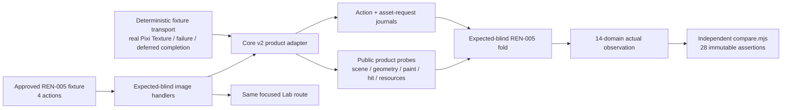

# REN-005 expected-blind automation and focused Lab plan

Status: implemented checkpoint and retained design record. This file does not revise the approved fixture,
normalized expected record, review registry, or Core v2 product contract.

## Contract lock

REN-005 is one exact capability route:

```text
/lab/core-v2?scenario=REN-005&size=<SIZE>&seed=<SEED>
root test ID: scenario-ren-005
fixture profile: rendering-specimens / image-specimens
actions: 4
assertions: 28
capture checkpoints: 1, after action 3
cleanup: destroy-case with expectedResourceDelta 0
```

The canonical action order is immutable:

1. `loadDataset({datasetId: "image-specimens"})`
2. `resolveAsset({targetId: "descriptor", requestId: "old", completeAtMs: 100})`
3. `replaceSource({targetId: "descriptor", source: "fixture-image", timeMs: 20})`
4. `completeAsset({requestId: "old", timeMs: 100})`

The implementation must register exactly `contract/loadDataset`,
`contract/resolveAsset`, `contract/replaceSource`, and `contract/completeAsset` for
this selected case. Adjacent handlers, skipped actions, reordered clock milestones,
or a replacement fixture are harness failures.

## Trust boundary and reusable pattern



Reuse the existing executor, materializer, action registry, cleanup ledger,
semantic observer, comparator, executable Lab bridge, presenter shell, manual clock,
and first/repeat/fresh browser checkpoint structure. Add only a bounded image handler,
image fold, runtime descriptor/product adapter, fixture transport, and their tests.

The handler and fold remain browser-safe ESM with no Node import, expected file,
comparator, or canonical assertion literal. Only the separate fold test and browser
checkpoint may import `compare.mjs` and the approved expected record.

## Deterministic transport versus product facts

The REN-005 fixture transport may control only facts an actual server or decoder would
control:

- return a real Pixi texture for `fixture-image`, the authored URL, the descriptor,
  and the canonical data URI;
- delay the descriptor request until the controller completes request `old`;
- reject `fixture://failed-image.png` without issuing a browser network request; and
- expose request start, settle, cancel, release, and sanitized coordinator/binding
  identity to an append-only request journal.

The transport must not return normalized observation objects, bounds, hit results,
paint roles, diagnostic counts, or stale-attachment counts. Those are product facts.
The focused route uses an isolated `CoreV2AssetBackend` so delayed, rejected, and late
completions are deterministic and issue no fixture network requests. That backend
returns actual Pixi `Texture` instances to the real Sprite/WebGL renderer; it does not
claim to exercise the public Pixi `Assets` loader. `AST-001` separately owns the public
Pixi `Assets` lifecycle proof. A Node test double may verify handler plumbing, but its
output is never headed or promotion evidence.

The product adapter must fail closed if the product does not expose a required fact.
It must never substitute fixture setup values, derive an answer from the expected
record, reuse a nearby semantic field, or emit zero/empty defaults. In particular:

- authored source, source kind, normalized resource identity, sanitized cache
  identity, resource state, generation, and stale-attachment count come from the
  product image/resource probe;
- world bounds come from the product geometry snapshot;
- hit bounds and point hits come from the product spatial/hit index, independently of
  the geometry snapshot used for capture;
- opacity, z-index, visibility, render-object count, and placeholder role come from
  semantic/renderer probes;
- diagnostic count comes from the actual target-scoped diagnostic journal; and
- abandoned requests and lease/pending counts come from the resource/request cleanup
  ledgers.

The `fixture-image` alias and transformed specimen must share the same canonical
binding while both are consumers. The adapter derives `reusedResolvedResource` from
that semantic binding and its consumer count; decoded object/reference equality is
explicitly forbidden and no Pixi object or address is serialized.

## Product adapter and journals

Create a REN-005 runtime descriptor following the existing `REN-007` and `AST-001`
descriptors. Its per-run closure owns one asset runtime, one deterministic fixture
transport, and one product adapter. The proposed adapter surface is:

```text
loadImageDataset(engine, { datasetId, dataset })
bindPendingImageRequest(engine, { targetId, requestId, completeAtMs })
replaceImageSource(engine, { targetId, source, timeMs })
completeImageRequest(engine, { requestId, timeMs })
inspectImages(engine, ids)
inspectImageHit(engine, targetId, point)
inspectAssetRequests()
```

These methods delegate to public Core v2 operations and probes. They do not construct
folded observation leaves.

Maintain two append-only journals.

### Action journal

Each entry records the canonical action index/type, requested logical target, accepted
scene/lifecycle revision tuple, semantic commit result, published frame tuple, and
completion status. Executor timing fields remain executor-owned.

### Asset-request journal

Each request entry records sanitized authored identity, product cache identity,
coordinator request/binding identity, target ID, request ID, asset generation,
start/settle/cancel/release transitions, whether a decoded resource was obtained,
whether it attached, whether it was stale, and remaining lease/pending counts. Raw
data URIs, URL credentials, decoded-object identity, Pixi objects, and native resource
addresses are forbidden.

`staleAttachCount` counts only a late resource that reached the authoritative target
after its source generation changed. A correctly decoded but generation-rejected old
resource records `settled: true`, `attached: false`, `stale: true`, and eventually
`released: true`.

## Action design: 4/4

| Index | Handler responsibility | Required actual delta |
| ---: | --- | --- |
| 0 | Resolve a detached clone of `image-specimens`, initialize the actual WebGL engine, register `fixture-image`, load the dataset, publish the first useful frame, and settle only the immediate success/failure assets. Leave the descriptor request pending. | Input fingerprint/unchanged result; load result; initial scene/frame revisions; static specimen product probes; failed-target diagnostic; request/lease snapshot. |
| 1 | Bind the product-created pending descriptor request to declared request ID `old` and controller deadline 100. Do not complete it and do not manufacture a resolved resource. | Pending request generation, sanitized authored descriptor, actual cache identity, pending/lease counts, unchanged target source, action journal entry. |
| 2 | Advance the manual clock to 20, patch target `descriptor` to source `fixture-image`, await semantic commit and the replacement frame, and observe the target from geometry, hit, paint, and resource probes. | Committed patch result; source/generation before and after; new published tuple; alias resource reuse fact; old request still pending and unattached. |
| 3 | Advance the clock to 100, resolve request `old` with a real decoded texture, await its product generation rejection and release boundary, then perform the one explicit terminal publication used for the declared capture. Inspect the target and all request/resource ledgers. | Old request settled but did not attach or emit false success; final target remains `fixture-image`; product-owned attempt is stale; controlled backend token is released/unloaded; terminal resource, lease, and pending probes are clean. `captureSource` is `{descriptor:{worldBounds:<geometry probe>}}`. |

The explicit action-3 publication is part of deterministic capture orchestration, not
evidence that a stale completion invalidated the renderer. Scheduler/renderer unit
tests separately prove that rejected late completion does not create an automatic
extra frame.

The action-3 capture source supplies the approved checkpoint path
`/captures/images/descriptor/worldBounds`. The folded
`/resources/images/descriptor/hitBounds` must come from the independent hit-index
probe, so equality proves shared published geometry rather than copying one value to
both sides.

## Fold projection: 28/28 actual leaves, 25/28 strict passes

The fold validates exact case/trace/capture/cleanup structure before projection. It
then maps only action deltas, terminal snapshots, semantic probes, event journals,
captures, and cleanup facts into all fourteen observation domains.

| # | Actual leaf | Product fact and action owner |
| ---: | --- | --- |
| 1 | `resources.images.alias.bounds` | Alias world bounds from action 0 geometry probe. |
| 2 | `resources.images.url.bounds.width` | URL specimen world-bounds width from action 0. |
| 3 | `resources.images.descriptor.source` | Final authored source from action 3 product resource probe. |
| 4 | `resources.images.descriptor.staleAttachCount` | Descriptor generation/request journal after action 3. |
| 5 | `resources.images.descriptor.hitBounds` | Final hit-index bounds; compared independently with the action-3 geometry capture. |
| 6 | `resources.abandonedRequests` | Fold cross-validates the exact product attempt and controlled-backend token against post-destroy AST/backend cleanup and unload ledgers, then projects only zero-valued leak counters required by `noLeak`. |
| 7 | `scene.revision` | Terminal engine snapshot scene revision. |
| 8 | `geometry.finiteValueCount` | Terminal semantic geometry probe. |
| 9 | `paint.commandCount` | Actual renderer debug snapshot after final publication. |
| 10 | `interaction.activeGestureCount` | Terminal semantic interaction probe. |
| 11 | `resources.images.data-uri.sourceKind` | Product resource probe, sanitized as a kind only. |
| 12 | `geometry.images.data-uri.worldBounds` | Data-URI geometry snapshot from action 0/final terminal state. |
| 13 | `paint.images.data-uri.opacity` | Semantic paint probe. |
| 14 | `scene.images.data-uri.zIndex` | Semantic scene/order probe. |
| 15 | `geometry.images.transformed.worldBounds` | Affine geometry snapshot, not fixture arithmetic in the handler. |
| 16 | `scene.images.transformed.zIndex` | Semantic scene/order probe. |
| 17 | `scene.images.hidden-image.renderObjectCount` | Renderer image-slot/object probe for hidden target. |
| 18 | `interaction.images.hidden-image.hit` | Actual center-point hit test using the fixture-declared authored center. |
| 19 | `paint.images.hidden-image.opacity` | Semantic paint state retained even though no render object exists. |
| 20 | `geometry.images.failed-image.placeholderBounds` | Product placeholder geometry after the failed request. |
| 21 | `interaction.images.failed-image.hitProbe` | Product point hit at the center derived from fixture position/fallback size. |
| 22 | `paint.images.failed-image.role` | Product semantic paint role. |
| 23 | `outcome.images.failed-image.diagnosticCount` | Target/attempt-scoped diagnostic event count. |
| 24 | `resources.images.alias` | Product-authored source, normalized identity, cache identity, and state. |
| 25 | `resources.images.url` | Product-authored URL, normalized identity, cache identity, and state. |
| 26 | `resources.images.descriptor.initial` | Settled old-request resource facts from action 3, separate from final attachment. |
| 27 | `resources.images.data-uri` | Product source-kind, normalized identity, cache identity, and state. |
| 28 | `resources.images.transformed` | Product alias identity plus semantic shared-binding/consumer reuse boolean and state. |

Do not build any of leaves 24–28 from string templates in the handler or fold. A
missing semantic asset identity is an implementation gap and must fail the run.

## Cleanup and determinism

`destroy-case` runs from the executor `finally` path on success, handler failure,
timeout, browser error, and cancellation. It must:

1. detach/destroy all image sprites and the surface before unloading owned textures;
2. invalidate and settle/cancel every controlled request;
3. release every image acquisition and per-instance asset lease;
4. destroy the engine and remove listeners, callbacks, timers, and the canvas; and
5. report zero canvas, subscription, pending-work, pending-asset, lease, stale
   attachment, and case-owned resource deltas.

The fold rejects incomplete cleanup, nonzero runtime/backend resources, pending work,
leases, cleanup entries, failed/missing expected unloads, or an exact old request whose
product attempt and controlled-backend token do not both reach terminal released
state. A negative fold probe deliberately retains the old request/lease and must fail.
Cleanup facts remain in the actual even when an earlier action fails.

Determinism requires `runCase`, same-page `repeatCase`, and a fresh browser context to
produce the same stable actual digest after only approved volatile fields are masked.
They must also match action order/status, request-journal transition order, capture
count/path, terminal revision tuple, diagnostic count, and cleanup. Route `size` and
`seed` are recorded but do not rewrite this fixed fixture.

## Focused Lab: one route

Promote only REN-005 from stub to `actual-observable`; do not add another image route.
The existing light shell retains `Run exact case`, `Repeat`, `Reset`, and destroy
behavior. Add a REN-005 presenter panel inside the same root with:

- an asset-source chooser for the seven approved specimens;
- authored source kind, sanitized resource/cache identity, state, generation, bounds,
  opacity, z-index, visibility, render-object count, hit result, and diagnostic count;
- a four-row canonical action timeline with queued/running/completed state;
- the delayed old-request journal showing scheduled, replaced, settled-stale, and
  released transitions; and
- current canvas, pending asset, lease, stale attachment, FPS/long-task, and cleanup
  counters.

The chooser is observational: it selects which specimen facts and overlay are shown;
it cannot rewrite the canonical action trace. The failure and delay controls replay the
declared fixture only through `Run exact case`/`Repeat`. The Lab displays actual facts
and `observed`, never expected values or `pass`.

## Headed browser proof

Add a REN-005 browser checkpoint following the existing render and AST scripts. It
must use the canonical route and an actual Pixi WebGL canvas, then prove:

- exactly one focused root and four completed action rows;
- first, repeat, and fresh runs each compare all 28 assertions through the independent comparator and expose exactly the same 25 passes plus three immutable parent-object conflicts;
- equal stable actual digests and request/capture ordering across all three runs;
- one canvas maximum during a run and zero after each cleanup/destroy;
- actual alias, URL, descriptor, data-URI, transformed, hidden, and failed-placeholder
  product observations, including the descriptor replacement visible before old
  completion;
- old completion produces no stale attachment, false success event, or retained
  request/resource; the capture publication is explicit and automatic invalidation is
  bounded by the separate scheduler/renderer proof;
- hidden image has no rendered pixels/object and is not hit; failed placeholder is
  visible and hit at the declared center; transformed image occupies the rotated
  bounds;
- semantic capture, public extract capability, and exact geometry/hit/role probes for visible, hidden, and placeholder regions; raster screenshots remain non-normative and are not used to fabricate or promote semantic assertions;
- WebGL backend, manual frame publication, no second canvas, and no unexpected network
  request for the intentional failure; and
- zero console errors, page errors, request failures, unexpected HTTP responses, and
  prohibited external fixture requests.

The browser report is stdout-only checkpoint evidence unless the primary agent runs
the separate append-only evidence workflow. It never edits canonical artifacts.

## Implementation and test checkpoints

1. Add browser-safe `handlers/render-images.mjs`; handler tests enforce exact 4/4
   coverage, operand drift rejection before engine allocation, expected-import
   firewall, immutable input, actual request transitions, stale completion, and
   finally cleanup.
2. Add `fold-render-images.mjs`; fold tests enforce fourteen domains, exact one capture,
   zero cleanup, deep freeze, browser-safe imports, and independent comparison of all 28 assertions with the exact three immutable conflicts.
   A negative test mutates one actual product fact and requires the comparator to
   expose that exact failed path.
3. Add the REN-005 runtime descriptor, deterministic transport, and strict product
   adapter. Unit adapters may not be reported as browser proof.
4. Add REN-005 to executable-case counts/action definitions and the same focused Lab
   bridge. Route tests require exact root/action IDs and no nearby presenter.
5. Add source Lab first/repeat tests, then the real headed checkpoint with a fresh
   context, error capture, canvas maximum, semantic capture, and cleanup assertions.

Completion accounting:

| Gate | Required |
| --- | ---: |
| Canonical actions registered/executed | 4 / 4 |
| Immutable assertions compared | 28 / 28; 25 pass + 3 immutable conflicts |
| Declared captures | 1 / 1 at action 3 |
| Cleanup actions | 1 / 1 with zero delta |
| Focused routes | 1 / 1 exact REN-005 route |
| Deterministic observations | first = repeat = fresh |
| Headed browser errors | 0 console / page / network |

The 2026-07-20 checkpoint satisfies every row above. Its nine-route headed WebGL run
reports exactly 125/128 strict comparisons for first, repeat, and fresh sessions, with
the same three immutable REN-005 parent-object conflicts; every run returns the canvas
count to zero and reports no console, page, or network errors. Packed ESM/CJS and 2+7
lifecycle verification also pass. Their generated result JSON is intentionally restored
to the frozen baseline after the observational rerun.
