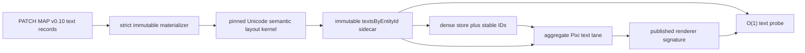

# REN-006 / REN-011 deterministic text product plan

Status: implementation-ready product plan. Approved fixtures, normalized expected
records, review evidence, and international-text evidence remain immutable.

## Contract lock

This tranche implements exactly two P0 rendering capabilities:

| Case | Actions | Assertions | Product scope |
| --- | ---: | ---: | --- |
| `REN-006` | 6 | 30 | standalone multiline/Unicode text, style/transform preservation, fallback, rapid replacement |
| `REN-011` | 4 | 20 | item text split, grapheme integrity, CJK/bidi, placement, wrap, overflow, auto font, upright orientation |

The normative semantic profile is
`core-v2-international-text-observation/1`: Unicode 16.0.0, UAX-29 revision 45,
UAX-14 revision 53 with CJ treated as NS, UAX-9 revision 50, locale `und`, automatic
base direction, source normalization `none`, and CRLF/CR-to-LF layout normalization.
Semantic bounds are deterministic advance frames, never Pixi ink bounds or browser
pixels.

`REN-006` must retain the authored `100 x 60` size as an overflow frame while its
final natural semantic layout remains `88 x 20`. The rotated world AABB is derived
from that natural layout and the authored transform, not from the frame.

`REN-011` has a deliberate evidence boundary: the base dataset contains only
`zero`, `positive`, `negative`, and `bidi`. Its seven contract-matrix rows exist in
fixture parameters and mix authored inputs with expected-looking outputs. Product
code must never echo `chosen`, `lines`, `visibleText`, `layoutBounds`, `screenAngle`,
or `rgba` from those rows.

## Architecture



Add `src/core-v2/semantic/text-layout.ts` as the only semantic text-layout authority.
It returns an immutable record containing:

- exact source and LF-normalized layout source;
- grapheme clusters, hard/wrapped/split lines, visible text, and line count;
- base direction, logical/visual bidi runs, and logical-to-visual mapping;
- deterministic font/fallback runs and missing-glyph observations;
- selected font size, line height, baseline, letter spacing, split, wrap, overflow,
  content frame, semantic layout bounds, and owner-local bounds;
- renderer route (`bitmap-text` or `fallback-text`), content signature, style
  signature, and complete layout signature.

Extend `CoreV2ProjectionIndex` with `textsByEntityId`. Parser candidate creation,
dense reconcile, and projection replacement remain one atomic authority change. A
text-sidecar signature change is a real reconcile change even if the dense numeric
bounds happen to remain equal.

## Deterministic Unicode rules

Do not use `Intl.Segmenter`, Pixi `TextMetrics`, `Text.width`, `getBounds`, canvas
measurement, or system font fallback as the semantic source. Native APIs may be used
only as non-authoritative optimizations checked against the pinned result.

The implementation starts with versioned, self-authored Unicode 16 property ranges
needed by the declared profile and implements the relevant UAX rules directly:

- grapheme segmentation preserves CRLF, Hangul sequences, Extend/ZWJ/spacing marks,
  prepend classes, regional-indicator pairs, emoji modifiers, variation selectors,
  and extended-pictographic ZWJ sequences;
- layout line endings normalize CRLF and CR to LF without modifying the exported
  source;
- positive `split=N` chunks each hard line by grapheme count, while zero and negative
  split preserve the hard line and cannot loop;
- hard breaks and pinned line-break opportunities are applied before optional
  `breakWords`; forced width splits always choose the largest whole-grapheme prefix;
- bidi derives automatic base direction and stable logical/visual runs from pinned
  bidi classes; source and semantic line order remain logical;
- combining marks, ZWJ, and variation selectors add zero advance; BMP half-width is
  8 px, BMP full-width and supplementary clusters are 16 px at the 16 px profile;
  letter spacing is inserted only between grapheme clusters;
- empty text still has one line-height box;
- hidden overflow keeps the largest fitting grapheme prefix; ellipsis first reserves
  the deterministic 8 px ellipsis marker; visible overflow retains natural bounds;
- auto font checks inclusive integer sizes from max to min and chooses the largest
  fully fitting candidate; if none fits, min size is used with the declared overflow;
- requested-font failure uses `unifont-base-16.0.04`, supplementary-plane content
  uses `unifont-upper-16.0.04`, and uncovered input uses the deterministic missing
  glyph box. No OS font substitution changes semantic facts.

Any code point or algorithm branch outside the declared supported table must emit a
structured unsupported diagnostic. It may not silently switch to browser-dependent
segmentation or measurement.

## Parser and geometry

Replace the current code-point width, `ceil` wrapping, authored-height substitution,
code-point ellipsis, and component text degradation paths with the kernel result.

- Standalone text uses semantic layout bounds for dense geometry. An authored size is
  only the overflow/wrap frame.
- Item text layout begins from the existing padded content box and placement/margin
  rules. Preserve origin-based layout bounds and add owner-local bounds so the placed
  row can expose `[219,135,16,20]` without fixture arithmetic in automation.
- `follow-item` keeps the authored item basis. `upright` uses the existing affine
  counter-transform around the stable visible center and derives screen angle from
  the actual screen basis.
- World and hit bounds consume the same text sidecar geometry used by the renderer.
  No text-specific hit approximation is permitted.
- Stable element IDs, component IDs, dense entity IDs, slots, and input immutability
  follow the existing reconcile contract.

## Pixi renderer boundary

The leaf layer consumes precomputed visible text and style from the sidecar. Pixi is
the raster sink, not the semantic layout engine.

- Use `BitmapText` only for bounded ASCII/Latin/numeric content whose exact finite
  atlas coverage and supported style are known.
- Use guarded `Text` for CJK, Arabic/bidi, emoji, combining sequences, fallback runs,
  missing glyphs, multiline advanced layout, and any unsupported bitmap style.
- Disable Pixi word wrapping as a semantic decision; send prewrapped visible text.
- Apply the sidecar's chosen font size, line height, letter spacing, alignment, tint,
  opacity, and public affine Matrix.
- Keep one text DisplayObject per logical text entity/component. Do not add per-glyph
  nodes, SplitText, listeners, tickers, or closures.
- Track current semantic layout signature, attached leaf signature, and last rendered
  signature. Rapid patches before one manual frame may update semantic authority but
  cannot claim the intermediate signature was rendered.
- Hidden/destroyed text removes its leaf and published paint fact. Destroy clears all
  text objects, font ownership, signatures, and pending work.

The semantic font profile is independent of raster resource readiness. Font loading
uses a separate scoped text-font runtime rather than changing the exact Fira-only
`CORE_V2_BUILTIN_ASSETS` registry. The two approved Unifont files remain immutable
inputs; package inclusion, license notice, byte size, FontFace registration, preflight,
and cleanup require explicit package tests before final promotion.

## Public product probe

Expose one O(1) API through Core, Surface, and Engine:

```ts
type CoreV2TextTarget =
  | { readonly kind: 'element'; readonly id: string }
  | { readonly kind: 'component'; readonly ownerId: string; readonly id: string };
```

The probe joins only indexed product state and contains semantic text/layout facts,
owner-local/world/hit bounds, style/paint intent, visibility/z/opacity/transform,
renderer route/object count, current/attached/published signatures, publication
status, stale-glyph count, and revision tuple. It must not scan Pixi children or expose
Pixi objects.

Before a successful render, renderer facts are `pending` rather than copied from the
prior frame. After a successful frame, the probe is `current` only when entity ID,
layout signature, renderer signature, and frame revision correlate.

## Product checkpoints

1. Pure layout-kernel corpus tests: exact approved Unicode profile plus poisoned and
   boundary inputs, deterministic repeat, frozen outputs, and no native measurement.
2. Parser/projection tests: standalone natural bounds versus authored frame, component
   split/wrap/overflow/placement/upright, stable reconcile, and explicit diagnostics.
3. Core/Engine probe tests: O(1) element/component targeting, revision alignment,
   rapid-patch publication, world/hit parity, hidden/destroyed absence.
4. Real Pixi leaf tests: BitmapText/Text routing, applied style, zero stale glyphs,
   manual frame publication, cleanup, and no per-glyph/per-entity hot-path listeners.
5. Package/font and large-scene performance gates only after semantic and actual
   automation are stable.

## Risks and selection criteria

- Full pinned Unicode behavior is larger than the current parser approximation; keep
  the kernel pure and table-driven so review and corpus tests remain independent of
  Pixi.
- The seven REN-011 matrix outputs are an answer-evidence leak risk. Supplemental
  product specimens must be constructed from independently declared authored inputs
  and observed through the public probe.
- Text texture creation can dominate first render and random updates. Measure semantic
  layout, glyph/texture work, upload, and next-frame visibility separately.
- The approved Unifont resources add roughly 11 MB before packaging decisions.
  Package size and licensing remain visible gates, not hidden implementation details.
- Raster pixels are environment-qualified. Geometry, visible text, fallback identity,
  style intent, route, publication, and cleanup are normative.
- Windows-native and WebGPU claims remain pending until measured on those targets.

