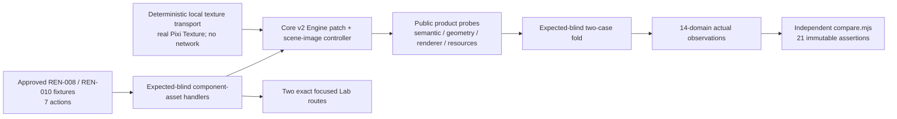

# REN-008 / REN-010 expected-blind automation and focused Lab plan

Status: implementation-ready plan. The approved fixture, normalized expected records,
review registry, and evidence manifest remain immutable.

## Contract lock

This tranche promotes exactly two P0 capability routes and no adjacent rendering case.

| Case | Canonical route | Root test ID | Actions | Assertions | Capture | Cleanup |
| --- | --- | --- | ---: | ---: | --- | --- |
| `REN-008` | `/lab/core-v2?scenario=REN-008&size=<SIZE>&seed=<SEED>` | `scenario-ren-008` | 4 | 10 | `initial`, after action 0, path `id` | one `destroy-case`, `expectedResourceDelta: 0` |
| `REN-010` | `/lab/core-v2?scenario=REN-010&size=<SIZE>&seed=<SEED>` | `scenario-ren-010` | 3 | 11 | none | one `destroy-case`, `expectedResourceDelta: 0` |

The exact canonical traces are:

```text
REN-008
0 loadDataset({datasetId:"background"})
1 replaceComponentSource({ownerId:"item",componentId:"bg",source:"fixture-image",timeMs:20})
2 setComponentVisibility({ownerId:"item",componentId:"bg",show:false})
3 setComponentVisibility({ownerId:"item",componentId:"bg",show:true})

REN-010
0 loadDataset({datasetId:"icon"})
1 replaceSource({target:{ownerId:"item-a",id:"icon"},source:"fixture-icon-2",timeMs:20})
2 patch({target:{ownerId:"item-a",id:"icon"},changes:{tint:"#00ff00ff"}})
```

The handler registration union is exactly `contract/loadDataset`,
`contract/replaceComponentSource`, `contract/setComponentVisibility`,
`contract/replaceSource`, and `contract/patch`. `replaceComponentSource` is the only
action type not already present in the current executable action union.

After promotion the executable catalog accounting must be exactly:

| Measure | Before | After |
| --- | ---: | ---: |
| executable cases | 24 | 26 |
| explicit stubs | 149 | 147 |
| executable actions | 102 | 109 |
| executable action types | 62 | 63 |

## Fixture semantics

### REN-008 background

The `background` dataset is one `100 x 80` item with scalar padding `10` and one
component whose stable semantic identity is `(ownerId: "item", id: "bg",
type: "background")`. Its initial source is a red rectangular texture style with
border width `2` and radius `8`; authored component size `20 x 10` is retained in the
normalized/exported dataset but is deliberately inert for paint geometry. The dense
render entity is `item::background:bg` and occupies the full item-local frame
`[0,0,100,80]`, independent of the `80 x 60` content box.

Action 1 changes only the component source to alias `fixture-image` at logical time
`20ms`. The logical component ID and dense entity ID remain stable while the render
representation changes from aggregate rect geometry to an aggregate image Sprite.
Action 2 removes that visible Sprite and its hit participation without removing the
semantic component. Action 3 materializes the current image state again under the
same component ID. The capture after action 0 records the exported semantic component
ID as `/captures/initial/id`; action 3 supplies `/scene/shown/id` from the product's
current component probe. The action journal additionally cross-checks the stable dense
entity ID across rect-to-image, hidden, and shown phases.

### REN-010 icon

The `icon` dataset is one `100 x 80` item with scalar padding `10`, hence content box
`[10,10,80,60]`. Its stable component identity is `(ownerId: "item-a", id: "icon",
type: "icon")`. Authored size `50% x 25%` resolves against the content box to
`40 x 15`. `right-top` placement with right margin `3` and top margin `2` produces
local/world bounds `[47,12,40,15]`, whose right edge is `87` and top is `12`.

Action 1 changes the alias from `fixture-icon` to `fixture-icon-2` at `20ms` without
changing geometry or identity. Action 2 changes only tint to `#00ff00ff`. The terminal
product probe must cross-check the normalized semantic tint with the packed renderer
tint/alpha used by the real Sprite; the fold must not merely echo the action operand.

Both datasets are detached clones supplied by the approved fixture profile. Route
`size` and `seed` are provenance inputs and never rescale, regenerate, or merge these
fixed specimens with the `rendering-specimens` profile's default `all-kinds-scene`.

## Trust boundary and reuse plan



Reuse these existing, already-tested seams unchanged in meaning:

- executor, materializer, manual clock, action registry, capture/cleanup ledger,
  semantic observer, comparator, executable Lab bridge, presenter shell, and
  first/repeat/fresh browser flow;
- `CoreV2Engine.loadDataset`, owner-qualified component `patch`, `exportDataset`,
  `semanticProbe`, `geometryProbe`, `sceneImageProbe`, `publishFrame`, and `destroy`;
- the REN-005 scene-image binding controller, aggregate Sprite container, scoped AST
  lease/release ordering, placeholder state machine, central invalidation, and
  post-frame unload boundary; and
- the public Pixi `Texture`/`Sprite` path and WebGL surface. As in REN-005, a local
  deterministic backend supplies actual `Texture` instances but does not claim to test
  the public Pixi `Assets` loader; `AST-001` owns that separate proof.

Do not reuse the sealed REN-005 or REN-003 case handlers directly. Their exact trace
validators intentionally reject these IDs and their target shapes differ. Add one
browser-safe component-asset handler and one fold for both new cases. If the fixture
transport is factored, preserve `createCoreV2RenderImagesRuntime()` as a REN-005 preset
over a generic image-fixture runtime. The generic transport may own registration,
successful texture settlement, sanitized request journals, and post-destroy resource
totals; REN-005 alone keeps its controlled delayed descriptor race. The component
preset registers exactly `fixture-image`, `fixture-icon`, and `fixture-icon-2` and has
no deferred request.

The transport may decide only decode/settlement facts. It must not provide component
bounds, authored size, placement, tint, visibility, render-object count, stale count,
revision, or retained-delta observations. Equal decoded `Texture` objects are allowed;
source and reuse identity come from semantic bindings, never object equality.

The product probe needs one small generalization before the fold can be complete:
component image records must expose the normalized authored tint together with the
renderer-applied packed tint/alpha (or another public cross-check of the same paint
intent). Bounds stay owned by `geometryProbe`; source/generation/state/stale attachment
stay owned by `sceneImageProbe`; component identity and authored inert size stay owned
by the normalized semantic export. Missing facts fail closed instead of becoming
zero, empty strings, fixture arithmetic, or nearby semantic fields.

## Handler design: 7/7 actions

Use a per-execution `WeakMap` state keyed by the executor's dataset resolver, matching
the current expected-blind handlers. Before any engine allocation, validate case ID,
action index/type, exact operand keys and values, fixture parameters, and abort state.

| Case/action | Product operation | Required actual delta |
| --- | --- | --- |
| REN-008 A0 | Register `fixture-image`, resolve only dataset `background`, fingerprint the detached input, initialize the WebGL engine, load, and publish. | Unchanged input fingerprints; load/revision tuple; exported item/background record; full-frame rect geometry; component and dense IDs; initial renderer/resource counters. Capture source `{id:<exported bg component id>}`. |
| REN-008 A1 | Advance clock to `20`, call `engine.patch({kind:"component",ownerId:"item",id:"bg"},{source:"fixture-image"})`, settle the exact current image binding, then publish. | Committed mutation; stable semantic/dense IDs; asset-backed image state; actual visible bounds; source/binding/generation; no current stale attachment. |
| REN-008 A2 | Patch the same component with `{show:false}`, publish the removal frame, and finalize frame-safe asset release. | Semantic component retained; renderer image object count `0`; no image hit/pixels; current resource/release counters. |
| REN-008 A3 | Patch the same component with `{show:true}`, settle its current binding, and publish. | Same semantic ID as capture; current source remains `fixture-image`; full-frame bounds return; one current image render object; terminal revisions and resource counters. |
| REN-010 A0 | Register `fixture-icon` and `fixture-icon-2`, resolve only dataset `icon`, fingerprint, initialize, load, settle `fixture-icon`, and publish. | Unchanged input; content box, component size/placement/margin, semantic source/tint, geometry, image binding, and revision tuple. |
| REN-010 A1 | Advance clock to `20`, convert target `{ownerId:"item-a",id:"icon"}` to the exact component target, patch source `fixture-icon-2`, settle it, and publish before releasing the prior binding. | Committed mutation; stable target/dense ID and bounds; new source/binding/generation; old binding no longer rendered; stale attachment count unchanged. |
| REN-010 A2 | Convert the exact target again and patch only `{tint:"#00ff00ff"}`, then publish. | Committed mutation; unchanged source/geometry/identity; semantic tint and actual Sprite tint/alpha agree; terminal revisions/resources. |

Every action snapshot contains product facts, not folded expected leaves: engine
snapshot, semantic probe, geometry probe, scene-image probe, normalized export,
component/dense target identity, and sanitized resource journal. The component target
must always be owner-qualified; a coincident component ID under another item is not an
acceptable fallback.

## Fold projection: exact 21 assertions

The fold validates the selected case, exact trace, captures, required domains, cleanup,
and product snapshot shape before projecting a fourteen-domain observation. It has no
Node import, expected import, comparator import, or canonical expected value table.

### REN-008: 10/10

| # | Canonical assertion | Product fact and action owner |
| ---: | --- | --- |
| 0 | `/paint/background/data/size` `orderedEq [20,10]` | A0 normalized export; preserve the authored inert component size. |
| 1 | `/paint/background/visibleBounds` `orderedEq [0,0,100,80]` | A3 renderer-aligned visible geometry for `item::background:bg`; no fixture-derived bounds fallback. |
| 2 | `/paint/background/source` `eq "fixture-image"` | A3 normalized component source cross-checked with current image authored source/binding. |
| 3 | `/paint/background/staleTextureCount` `zero` | A3 renderer/controller stale-attachment counter plus current binding/generation consistency. Safely discarded completion counts are not redefined as visible stale texture. |
| 4 | `/scene/hidden/renderObjectCount` `zero` | A2 public scene-image renderer probe for the stable dense entity. |
| 5 | `/scene/shown/id` `sameIdentity {$ref:"/captures/initial/id"}` | A3 current exported component ID versus the A0 declared capture. |
| 6 | `/scene/revision` `finite` | A3 terminal engine scene revision. |
| 7 | `/geometry/finiteValueCount` `gte 0` | A3 semantic/geometry product probe after checking every published component bound is finite. |
| 8 | `/paint/commandCount` `gte 0` | A3 actual renderer debug command count. |
| 9 | `/resources/retainedDelta` `noLeak` | Exact case baseline and post-destroy runtime/backend/controller zero ledger. |

Domain accounting is paint `5`, scene `3`, geometry `1`, resources `1`.

### REN-010: 11/11

| # | Canonical assertion | Product fact and action owner |
| ---: | --- | --- |
| 0 | `/paint/icon/bounds/width` `eq 40` | A2 renderer-aligned world-bounds width. |
| 1 | `/paint/icon/bounds/height` `eq 15` | A2 renderer-aligned world-bounds height. |
| 2 | `/paint/icon/bounds/right` `eq 87` | A2 bounds `x + width`, computed from the product bounds record. |
| 3 | `/paint/icon/bounds/top` `eq 12` | A2 product bounds `y`. |
| 4 | `/paint/icon/source` `eq "fixture-icon-2"` | A2 normalized component source cross-checked with the current image probe. |
| 5 | `/paint/icon/tint` `eq "#00ff00ff"` | A2 normalized semantic tint cross-checked with the renderer-applied RGB/alpha probe. |
| 6 | `/paint/icon/staleTextureCount` `zero` | A2 renderer/controller stale-attachment counter plus binding/generation consistency. |
| 7 | `/scene/revision` `finite` | A2 terminal engine scene revision. |
| 8 | `/geometry/finiteValueCount` `gte 0` | A2 semantic/geometry product probe after finite-bound validation. |
| 9 | `/paint/commandCount` `gte 0` | A2 actual renderer debug command count. |
| 10 | `/resources/retainedDelta` `noLeak` | Exact case baseline and post-destroy runtime/backend/controller zero ledger. |

Domain accounting is paint `8`, scene `1`, geometry `1`, resources `1`.

The canonical paths for both cases have no parent/child assertion overlap. Therefore
the implementation target is exactly `10/10` and `11/11`; there is no new immutable
strict-equality conflict to allowlist. The three pre-existing REN-005 parent-object
conflicts remain unchanged and are the only render-checkpoint failures.

## Capture, cleanup, and determinism

REN-008 has exactly one capture checkpoint. The executor accepts a capture source only
from action 0 and resolves only path `id`, producing `{initial:{id:<product component
id>}}`. An extra capture, a capture after another action, or a handler-generated copy
of the expected reference is a harness failure. REN-010 must produce no capture.

Each `destroy-case` runs from the executor `finally` path after success, assertion-fold
failure, action rejection, abort, timeout, or browser error. It must:

1. remove/destroy component Sprites and the render surface before releasing owned
   acquisitions;
2. retire current and prior source bindings only after a safe rendered boundary;
3. release case asset leases and settle all pending release work;
4. destroy engine, scheduler, listeners, observers, and canvas; and
5. report zero case-owned canvas, subscription, pending-work, binding, resource,
   lease, pending-settlement, pending-release, stale-attachment, and cleanup counts.

The fold cross-validates execution cleanup with the runtime's independent
post-destroy probe, then projects only the zero-valued count tree required by
`resources.retainedDelta`. It must reject a retained icon/background lease, stale
binding, renderer object, or omitted cleanup field. Negative fold/runtime tests retain
one resource or render object deliberately and must fail.

`runCase`, same-page `repeatCase`, and a fresh browser context use the same seed and
must have equal stable actual digests, action status/order, capture inventory, mutation
results, resource-journal order, terminal component state, and cleanup. Only the three
globally approved volatile provenance/environment fields are masked.

## Focused Lab: two one-to-one routes

Both routes use the existing light shell, transient real Pixi WebGL canvas, `Run exact
case`, `Repeat action`, `Reset case`, and `Copy URL`. The UI displays actual/observed
facts only; it does not import expected data, label assertions as pass, or permit a
phase selector to alter the canonical trace.

`REN-008` adds one `ren-008-background-inspector` scoped to
`scenario-ren-008`:

- a phase/source-style chooser for actual A0 rect, A1 image, A2 hidden, and A3 shown
  snapshots;
- stable semantic component ID and dense entity ID;
- authored inert size, full item frame, current source, resource state/role,
  binding/generation, visible bounds, render-object count, and stale counter;
- the four canonical action rows and one declared capture row; and
- current resource/lease/pending-release counts plus per-run FPS, maximum frame gap,
  and Long Tasks observation.

`REN-010` adds one `ren-010-icon-inspector` scoped to `scenario-ren-010`:

- an actual phase chooser for initial alias, replacement alias, and tint patch;
- content-box overlay and actual icon bounds;
- authored percentage size, placement, margins, current source/state/role,
  binding/generation, semantic/renderer tint, render-object count, and stale counter;
- the three canonical action rows; and
- the same resource and main-thread observation strip.

The choosers select already-observed action snapshots; product mutations occur only
through the exact executor trace started by the real Run/Repeat buttons. The page emits
the existing `core-v2-contract-run-complete` event with the same run object consumed
by automation.

## Headed browser proof

Extend the stdout-only render checkpoint to eleven routes and `149` assertions. The
exact aggregate result is `146 pass / 3 fail` for first, repeat, and fresh sessions;
the failures remain only the three declared REN-005 `VALUE_MISMATCH` parent paths.
REN-008 and REN-010 must each compare all assertions with zero failures.

Drive Run and Repeat through actual button clicks for both new routes, then prove:

- exact focused root, four/three completed action rows, and no nearby scenario root;
- REN-008 actual rect-to-image-to-hidden-to-shown phases, stable IDs, one capture,
  inert `20 x 10` data size, full `100 x 80` visible frame, zero hidden render object,
  and zero stale attachment;
- REN-010 actual `40 x 15` icon at `[47,12,40,15]`, source
  `fixture-icon-2`, tint `#00ff00ff`, and zero stale attachment;
- real WebGL renderer and Sprite attachment for the asset-backed phases, one canvas
  maximum during a run, and canvas `0` after every cleanup/destroy;
- no retained fixture resource, binding, lease, pending settlement/release, or renderer
  object after cleanup;
- identical stable actual digests and trace/resource order for first, repeat, and
  fresh contexts; and
- zero console errors, page errors, failed requests, unexpected HTTP responses, and
  external fixture network requests.

Screenshots and pixels remain diagnostic. Geometry, source, tint, identity,
visibility, renderer role/object count, revisions, and cleanup are the normative
proof.

## Implementation and validation checkpoints

1. Add the component-asset product probe fields and targeted parser/reconcile/leaf
   tests first: background authored-size roundtrip with full-frame geometry,
   rect-to-image stable entity identity, icon percentage placement, source replacement,
   renderer tint, hide/show, generation safety, and frame-safe release.
2. Add browser-safe `handlers/render-component-assets.mjs` and exact handler tests for
   all `7/7` actions, operand/target drift rejection before allocation, detached input,
   owner qualification, manual-clock milestones, expected-import firewall, and finally
   cleanup.
3. Add `fold-render-component-assets.mjs` and fold tests for exact domains, the one
   REN-008 capture/no REN-010 capture, deep freeze, cleanup cross-check, all `21/21`
   independently compared assertions, and no allowed new conflict. Mutate every
   assertion family and retain one resource in negative probes.
4. Add the component fixture-runtime preset and product integration tests using actual
   Pixi textures/Sprites. Preserve all REN-005 deterministic-race tests when factoring
   shared transport.
5. Register both IDs in canonical selected-fixture order after `REN-007`, update exact
   executable counts to `26 / 147 / 109 / 63`, add the runtime descriptor, and test the
   two exact routes and focused inspectors.
6. Update the render browser script/test to eleven routes and `149 / 146 / 3`, run the
   headed first/repeat/fresh checkpoint, and keep output stdout-only.

Targeted test set:

```text
tests/core-v2/render-projection-closure.test.ts
tests/core-v2/image-source-projection.test.ts
tests/core-v2/core-scene-images-integration.test.ts
tests/core-v2/leaf-layer.test.ts
tests/core-v2/contract-render-component-assets-handlers.test.ts
tests/core-v2/contract-render-component-assets-fold.test.ts
tests/core-v2/contract-render-component-assets-product-integration.test.ts
tests/core-v2/component-assets-runtime.test.ts
tests/core-v2/contract-lab-route.test.ts
tests/core-v2/contract-lab-execution.test.ts
tests/core-v2/contract-render-browser-script.test.ts
```

Then run scoped ESLint, `npm run typecheck`, `npm run build:lab:core-v2`,
`npm run verify:core-v2-contract`, and the headed render checkpoint. Because this
tranche changes shared image resource/probe behavior, run the full unit suite plus the
packed consumer and 2+7 lifecycle memory gates at the completed tranche checkpoint;
restore any frozen generated result files rather than committing rewritten evidence.

## Acceptance and stop conditions

Accept only when all seven actions are executed against the real product, all 21
assertions are independently compared with no new failure, both routes are directly
pressable and deterministic, and cleanup returns every owned resource to baseline.
Stop if the implementation derives values from expected data or fixture arithmetic,
loses owner-qualified component identity, lets background `size` affect full-frame
geometry, observes tint only from the action operand, creates per-component listeners
or tickers, attaches a prior-generation texture, releases a texture before its
replacement frame, issues fixture network requests, edits approved artifacts, or
allowlists a new comparator conflict.
